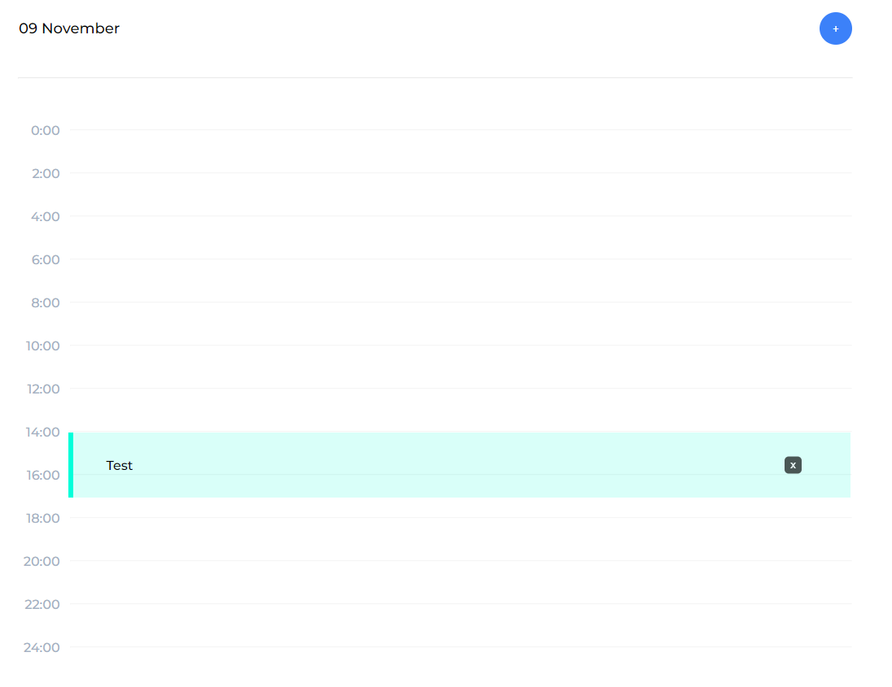

# Test technique Flying For You

J'ai créé une appli de calendrier simple en me rapprochant le plus possible du design donné.
Le calendrier permet d'ajouter et gérer des tâches en fonction du calendrier.

## Objectif

Les utilisateurs doivent pouvoir :
- Afficher la disposition optimale de l’application en fonction de l’appareil taille de l’écran (Responsive)
- Ajouter un nouvel événement au calendrier
- Supprimer les événements de la liste

[Design Figma](https://www.figma.com/file/75AixComjj3oC1whti6HVQ/Untitled?type=design&node-id=1-2963&mode=design)

## Spécificités techniques 

Pour ce test, j'ai utilisé :

- React
- SCSS
- Redux via Redux Toolkit
- Localstorage

Les packages React utilisés sont :

- Redux Toolkit 
- MUI pour les composants de date et de temps
- React Color pour choisir les couleurs des tâches
- date-fns pour la gestion du temps
- FontAwesome pour les icônes

## Mise en route de l'application

Pour faire fonctionner cette application :

- Télécharger le projet
- yarn
- yarn start
- Enjoy !

Ou sinon elle est disponible ici => [flyingcalendar.vercel.app](https://flyingcalendar.vercel.app)

## Description de l'application

L'application est présentée comme ceci :

### Calendrier

Il permet de :
- Voir les jours
- Naviguer entre les mois (avec les flèches ou en cliquant sur les jours du mois suivant)
- Voir s'il y a des tâches sur des jours
- Voir le jour actuel

### Liste des tâches

Elle permet de :
- Voir les tâches en fonction du jour sélectionné et des heures pour laquelle elle est programmée
- Ajouter des tâches via un bouton
- Supprimer une tâche en cliquant sur la croix
- Modifier une tâche en cliquant sur la tâche

### Ajout de tâche

Elle permet de :
- D'ajouter une tâche pour le jour sélectionné
- Il est possible de modifier le titre, la couleur, le jour, l'heure de début et de fin ainsi que rajouter un commentaire

### Visualisation de tâche

Elle permet de :
- De voir tous les détails sur la tâche (titre, couleur, date, commentaire, heure de début et de fin)
- Il est possible de modifier le titre, la couleur, le jour, le commentaire, l'heure de début et de fin
- Possibilité de supprimer la tâche

### Multi-Tâches

J'ai essayé de rendre possible l'affichage de plusieurs tâches à la même heure

### Rendu mobile 

